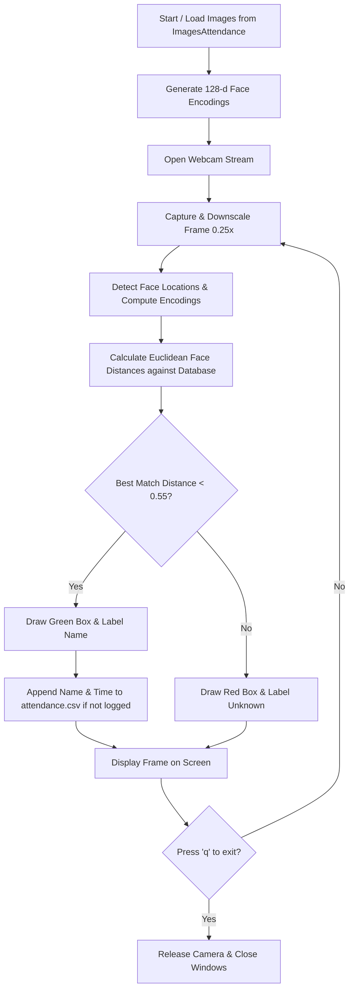

# Smart Face Recognition Attendance System

An automated, computer-vision-based attendance tracking system built in Python using OpenCV, dlib and `face_recognition`.

> This project was created in 2023 as the course project for the course titled **Computational Thinking and Programming (CSET101)**.

---

## Project Overview

Traditional attendance management methods (such as manual roll calls or paper-based sign-in sheets) are time-consuming and prone to proxy attendance. This project automates attendance logging using real-time biometric identification via webcam video streams.

The system encodes reference faces using a deep learning pipeline, continuously scans the webcam feed, locates faces in real-time, matches them against the database using Euclidean face distances and records the recognised individual's name and timestamp to a CSV spreadsheet.

---

## Key Features

- **Real-time face detection and recognition:** Fast facial recognition at 4x downscaled resolution for high FPS performance.
- **Automated CSV logging:** Automatically writes the attendee's name and arrival time into `attendance.csv` without duplicate entries on the same run.
- **Robust error handling:** Safely handles images without detectable faces, camera disconnection events and missing files.
- **Standalone verification utility (`faces.py`):** Includes a 1-to-1 face comparison script showing face bounding boxes, match boolean status and exact face distance metrics.
- **Interactive visual feedback:** Renders green bounding boxes and names for recognised faces and red boxes with "Unknown" tags for unrecognised individuals.

---

## How It Works



1. **Feature extraction:** Images stored in `ImagesAttendance/` are loaded, converted to RGB and passed through a pre-trained deep neural network that generates a **128-dimensional facial embedding vector** for each person.
2. **Webcam capture and optimisation:** Webcam frames are resized to 0.25x scale to speed up real-time inference.
3. **Face matching:** For every detected face in the frame, Euclidean distance is computed against all known database embeddings:
   $$\text{Distance} = \sqrt{\sum_{i=1}^{128} (x_i - y_i)^2}$$
4. **Attendance logging:** If the minimum distance is below the tolerance threshold ($< 0.55$), the face is recognised and attendance is stamped in `attendance.csv`.

---

## Project Structure

```text
├── ImagesAttendance/         # Folder containing reference photos for known individuals (includes sample celebrity reference images for demonstration)
├── attendance.py             # Main application
├── faces.py                  # Side-by-side 1-on-1 face distance comparison
├── elontest.jpeg             # Sample test image for comparison in faces.py
├── attendance.csv            # Output log file containing marked attendance
├── requirements.txt          # Project dependencies
├── .gitignore                # Files excluded from git tracking
└── README.md                 # Project documentation
```

---

## 🛠️ Installation & Setup

### 1. Prerequisites
- **Python 3.8 - 3.12**
- A working webcam / camera

### 2. Clone the Repository
```bash
git clone https://github.com/hmkol/face-recognition-attendance.git
cd face-recognition-attendance
```

### 3. Create a Virtual Environment (Recommended)
```powershell
python -m venv venv
.\venv\Scripts\activate
```

### 4. Install Dependencies
```powershell
pip install -r requirements.txt
```

> **Note on dependencies:** This project uses `numpy<2` and `setuptools<70` for binary compatibility with OpenCV and pre-trained dlib model loaders in `face_recognition_models`.

---

## How to Run

### 1. Real-time attendance tracker
Add reference photos of attendees into the `ImagesAttendance/` folder (name the image files as the person's full name, e.g. `John Doe.jpg`), then run:

```powershell
python attendance.py
```
- A window titled **"Webcam - Press Q to Exit"** will pop up.
- When an attendee looks into the camera, their face is framed in green and their name is logged in `attendance.csv`.
- Press **`q`** on your keyboard while focusing on the video window to stop the program.

### 2. 1-on-1 Face Comparison Demo
To test two static images against each other and calculate numerical face distance:
```powershell
python faces.py
```

---

## Sample Attendance Output (`attendance.csv`)

| Name | Time |
| :--- | :--- |
| BILL GATES | 09:15:32 |
| ELON MUSK | 09:18:04 |

---

## Course Background & Learnings
- **Course:** Computational Thinking and Programming (CSET101)
- **Key Concepts Practiced**:
  - Image manipulation abd color space transformation (BGR to RGB) using **OpenCV**.
  - Vector operations and multidimensional arrays with **NumPy**.
  - Deep metric learning principles and high-dimensional feature embeddings.
  - File I/O streaming and persistent data logging in CSV format.
  - Real-time video processing pipelines.

---

## License
This project is open-source and available under the [MIT License](LICENSE).
